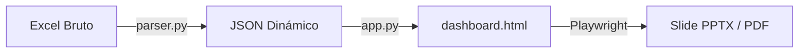

# Guía Técnica de Arquitectura y Diseño Visual de Reportes (DairyQueen Template)

Esta guía documenta detalladamente la arquitectura, las fórmulas matemáticas de diseño, las reglas de enmaquetado para diapositivas **Widescreen 16:9 (Pitch)** y los principios dinámicos aplicados para garantizar que el panel se adapte a cualquier cliente sin cortes de texto, sin desalineaciones y sin datos hardcodeados.

---

## 1. Arquitectura General del Sistema

El sistema opera como un pipeline fluido de tres capas:



1. **Extracción y Traducción (Backend):** Ocurre en `parser.py`. El script lee las celdas del archivo Excel sin librerías pesadas (usando descompresión nativa de XML), traduce las chaves del inglés al español y exporta un objeto de datos estructurado en formato JSON.
2. **Visualización Interactiva (Frontend):** Ocurre en `dashboard.html`. Utiliza **Chart.js** y **ChartDataLabels** para dibujar gráficos vectoriales de alta definición. El HTML cambia dinámicamente entre el **Tema Claro** y **Tema Escuro** leyendo variables CSS nativas.
3. **Conversión Estática (Servidor):** Ocurre en `app.py`. A través de **Playwright Headless**, abre el panel de forma invisible a una resolución exacta de `1400x900`, inyecta el tema seleccionado por el usuario y captura capturas de pantalla de alta fidelidad que se insertan en slides de PowerPoint o se exportan en PDFs vectoriales.

---

## 2. Reglas de Diseño Visual para Diapositivas Widescreen (16:9)

Para garantizar que el panel quepa perfectamente en una diapositiva del Pitch y que el exportador de PDF no realice saltos de página accidentales (Page Spillovers), se implementó un sistema de diseño rígido pero adaptativo.

### A. Bloqueo de Columnas en Impresión (Anti-Collapse)
Por defecto, las rejillas responsivas (`display: grid`) colapsan a una sola columna en pantallas móviles o ventanas pequeñas. Esto destruiría el diseño horizontal en la exportación de PDF.
* **La Solución:** Fijamos la estructura de rejilla en el CSS de impresión y en el modo PDF (`body.pdf-mode`):
  ```css
  @media print, body.pdf-mode {
    .g2 { grid-template-columns: 1fr 1fr !important; }
    .g3 { grid-template-columns: 1fr 1fr 1fr !important; }
    .g4 { grid-template-columns: 1fr 1fr 1fr 1fr !important; }
    .g12 { grid-template-columns: 1.5fr 1fr !important; }
    .g21 { grid-template-columns: 1fr 1.5fr !important; }
  }
  ```

### B. Alineación Simétrica de Alturas en Rejillas
Cuando varios cards están uno al lado del otro, cualquier diferencia en el margen inferior de los cards desalineará sus bordes inferiores.
* **La Solución:** Eliminamos los márgenes inferiores de los cards que son hijos directos de rejillas dinámicas:
  ```css
  .g2 > .card, .g3 > .card, .g4 > .card, .g12 > .card, .g21 > .card {
    margin-bottom: 0 !important;
  }
  ```

### C. Recuo de Seguridad en Gráficos Horizontais (Eje X)
Cuando dibujamos barras acumuladas (como en KBP 1, KBP 2, KBP 3, Rankings KBP y Áreas), las etiquetas numéricas con el total de alertas se posicionan en la punta derecha de las barras. Si la barra de la tienda líder se extiende al 100% de la pantalla, el número se dibuja fuera del lienzo de dibujo (Canvas) y se corta.
* **La Solución (La Fórmula Matemática del Recuo):** 
  En lugar de dejar que Chart.js calcule la escala horizontal de forma automática, calculamos dinámicamente el valor máximo del conjunto de datos (`maxVal`) y le sumamos **12% de respiro + 2 alertas fijas**:
  ```js
  const maxVal = sumArr[0] || 0; // Al estar ordenado de mayor a menor, el primero es el máximo
  const xMax = maxVal > 0 ? Math.ceil(maxVal * 1.12) + 2 : undefined;
  ```
  Al pasar `max: xMax` a las opciones de `scales.x`, la barra más larga se detiene con elegancia antes de llegar al borde derecho, abriendo el espacio exacto y garantizado para dibujar el número del total de alertas sin cortes.

### D. Protección Contra Cortes en Gráficos de Rosca (Velocidad)
En la pestaña **Velocidad**, posicionamos las etiquetas de porcentajes de forma limpia fuera de la rosca. Para evitar que las etiquetas superiores/inferiores toquen los bordes del canvas:
1. **Ampliación de Alturas:** Expandimos el contêiner del gráfico de roscas (`.speed-chart-container`) de `145px` a **`165px`** en pantalla, y de `110px` a **`130px`** en el modo PDF.
2. **Padding Interno de Seguridad:** Configuramos un margen interno (padding) en el motor de diseño del propio gráfico para obligar al círculo a encogerse levemente dentro del canvas:
   ```js
   layout: {
     padding: { top: 15, bottom: 15, left: 15, right: 20 }
   }
   ```
3. **Ajuste del Desplazamiento (Offset):** Fijamos las opciones del plugin de datalabels en `anchor: 'end'`, `align: 'end'`, `offset: 4`.

---

## 3. Principio de Cero Hardcoding (Datos 100% Dinámicos)

Para que el panel se adapte a cualquier cliente sin alterar el código HTML de visualización, cada elemento se renderiza leyendo del objeto de base de datos JSON inyectado en `D = {{ DATA_JSON | safe }}`:

### A. Leyendas de Doughnut Auto-Ordenadas
En lugar de usar las leyendas por defecto de Chart.js (que son difíciles de centrar y no muestran telemetría), generamos la lista de leyendas directamente en código HTML en tiempo de renderizado:
1. Extraemos los valores del JSON.
2. Generamos una lista ordenada con método `.sort((a,b) => b.val - a.val)`.
3. Calculamos la proporción porcentual y pintamos un punto con el color respectivo de la variable CSS del tema.

### B. Chips de KBP y Totales de Tarjetas
Títulos, cabeceras de desglose y totales dinámicos leen sus valores de variables del DOM vinculadas:
```js
if (document.getElementById('kbp1Chip')) {
  document.getElementById('kbp1Chip').innerHTML = `<span></span>KBP 1 — Experiencia del Cliente — ${fmt(D.ce)} alertas = ${D.ce_pct}%`;
  document.getElementById('kbp1TotalBox').textContent = fmt(D.ce);
}
```

### C. Negrita ("Grifado") de Alto Impacto en Resumen
Para dar máxima legibilidade às métricas extremas do painel, aumentamos o tamanho da fonte do indicador para `12px` usando cores do tema e injetamos tags de negrito (`<strong>`) nos valores através do javascript:
```js
document.getElementById('bestStoreAlerts').innerHTML = `<strong>${kb[2]}</strong> alertas totales`;
document.getElementById('worstStoreAlerts').innerHTML = `<strong>${kw[2]}</strong> alertas totales`;
```

### D. División de Lojas en Franquias Grandes (La Regla del 20)
Cuando el número de tiendas de un cliente supera las 20 unidades, los gráficos empilhados y tablas se vuelvem visualmente inmanejables. Creamos un interruptor dinámico (Toggle) en la lógica de renderizado:
* **Gráficos Split (KBP y Áreas):** Si `stores.length > 20`, se oculta el gráfico único y se muestran dos gráficos apilados verticalmente de 10 elementos: **Top 10 Peores Tiendas (Más Alertas)** y **Top 10 Mejores Tiendas (Menos Alertas)**. Ambos comparten exactamente la misma escala (`xMax`) para una lectura visual lógica e intuitiva.
* **Tablas Split (Delivery):** Si `stores.length > 20`, se oculta la tabla convencional y se renderizan simultáneamente dos tablas: una verde para las **Top 10 Mejores (Más Rápidas)** y otra roja para as **Top 10 Peores (Más Lentas)**, eliminando filas intermedias y manteniendo los rangos originales intactos de forma simétrica.

---

## 4. Sincronización de Temas Bidireccional (Claro / Oscuro)

Para garantizar un renderizado impecable del tema tanto en pantalla como en el PDF/PPTX exportado en segundo plano, implementamos un sincronizador basado en variables computadas.

1. **Variables CSS en la Raíz (`:root`):**
   Definimos todas las paletas de colores en variables CSS (`--bg`, `--surface`, `--card`, `--border`, `--text`, `--bright`, `--ce`, etc.) y las sobrescribimos en el selector de clase `.light-theme`.
2. **Método `getCol()` de Alta Fidelidad:**
   Desarrollamos un lector en Javascript que interroga las variables CSS aplicadas en el cuerpo (`body`) en tiempo real. Esto permite que los gráficos de Chart.js carguen colores directamente del CSS sin necesidad de configuraciones estáticas redundantes:
   ```js
   const getCol = (name) => {
     let clean = name.replace('var(', '').replace(')', '').trim();
     return getComputedStyle(document.body).getPropertyValue(clean).trim();
   };
   ```
3. **Flujo de Re-Dibujado (Redraw Flow):**
   Al alternar de tema, la función `toggleTheme()` reescreve los valores del objeto base de opciones de Chart.js (`co`), limpia la lista de pestañas ya dibujadas (`drawn.clear()`) y vuelve a llamar a la pestaña activa:
   ```js
   drawn.clear();
   drawn.add(activeTab);
   drawTab(activeTab); // Vuelve a dibujar el gráfico activo leyendo los nuevos colores de getCol()
   ```

---

## 5. Guía de Configuración para Nuevos Clientes

Cuando vayas a crear el dashboard de un **nuevo cliente**, solo debes seguir estas directrices:

1. **Planilla Excel:** Mantén los mismos encabezados y taxonomías que el pipeline ya interpreta.
2. **Personalización del Tema y Colores corporativos:** 
   Si el nuevo cliente requiere colores específicos en el Tema Claro o Tema Escuro, edita directamente las variables en el encabezado `<style>` del archivo `dashboard.html` (líneas 14 a 20 para el Tema Escuro y líneas 184 a 205 para el Tema Claro). **No es necesario modificar el código javascript de los gráficos ni de los controladores.**
3. **Ejecutar Pruebas Locales de Compilación:**
   Antes de subir los archivos, abre la terminal PowerShell y ejecuta los validadores automáticos:
   * `node yedda-app/test_js.js` (Debe reportar success en todos los módulos de dibujo).
   * `python yedda-app/test_all_parsers.py` (Debe verificar la correcta conversión de las planilhas Excel a JSON).
